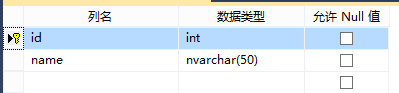
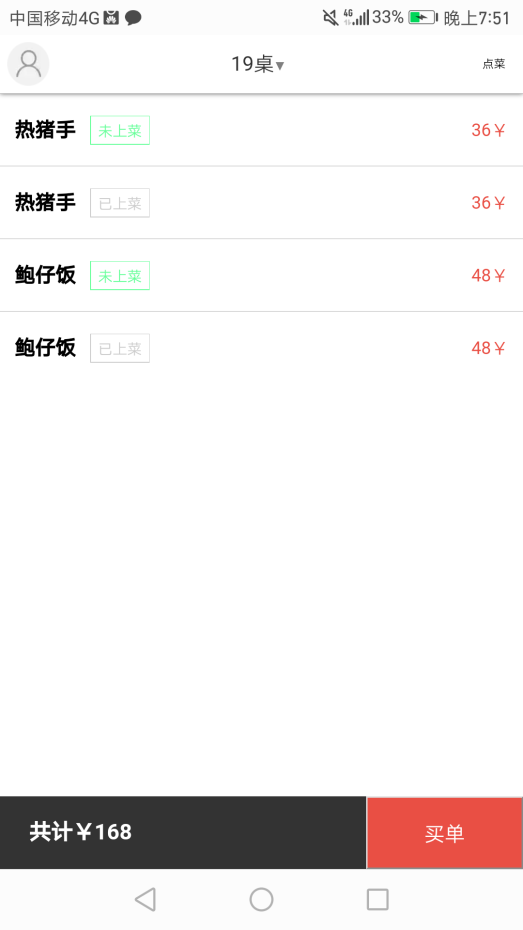
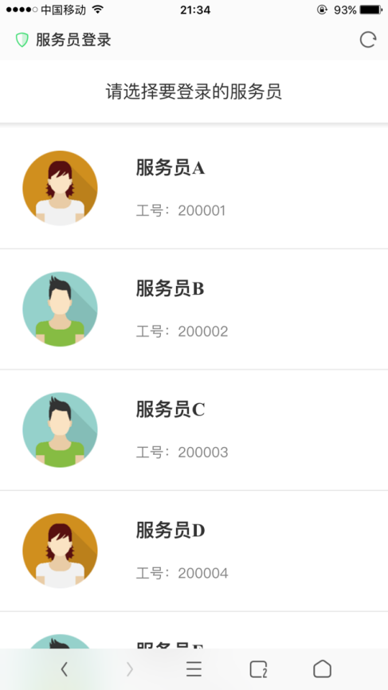
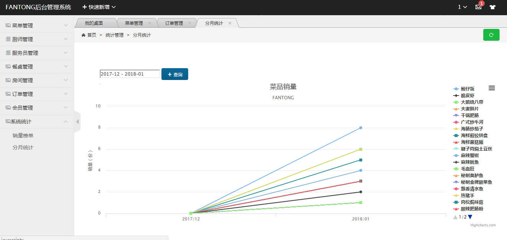
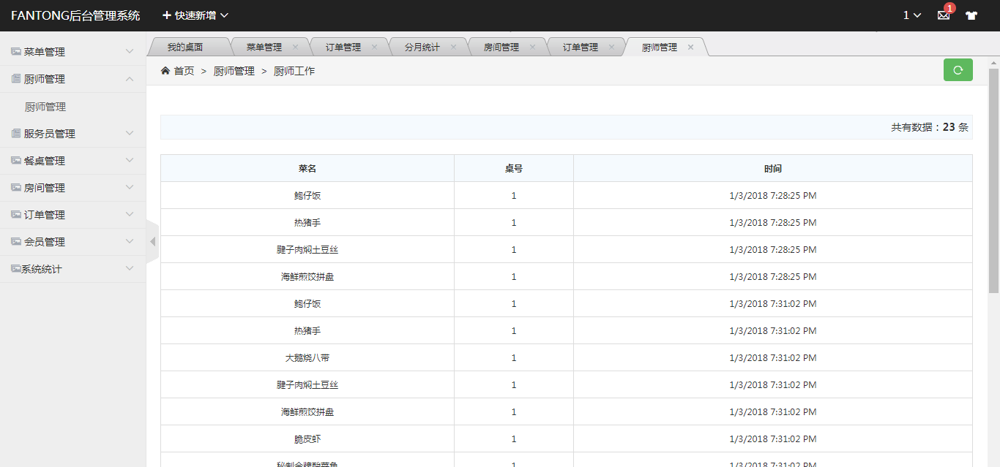

# 基于WebSocket 的即时点菜系统


**目录**

[一、 需求分析 ](#需求分析)

[1.系统概述 ](#_Toc20648)

[2.功能角色分析 ](#_Toc3355)

[3.信息要求 ](#_Toc1579)

[4.处理要求](#_Toc2868)

[5.安全性与完整性要求 ](#_Toc31009)

[二、 概念结构设计 ](#概念结构设计)

[1.实体 ](#_Toc26805)

[2.E-R图](#_Toc6015)

[三、 逻辑结构设计](#逻辑结构设计)

[1.E-R模型向关系模型的转换](#_Toc17716)

[2.转换过程中的一些调整](#_Toc27257)

[四、 物理结构设计](#物理结构设计)

[五、 数据库实施 ](#数据库实施)

[1.建立数据库和表 ](#_Toc31005)

[2.建立各类约束条件 ](#_Toc12721)

[3.使用C\#连接SQL Server](#_Toc8385)

[4.基于WebSocket的即时通信](#_Toc15321)

[5.使用事务 ](#_Toc22951)

[6.Session验证技术 ](#_Toc31535)

[7.防SQL注入技术 ](#_Toc3375)

[六、 数据库运行和维护 ](#数据库运行和维护)

[1.系统部署 ](#_Toc24196)

[2.系统使用说明 ](#_Toc32242)


需求分析
========

**1.系统概述**

目前大部分餐饮企业的点菜系统处于一个相对匮乏的状态，一般都采用人工方式，或者使用自动化程度较低的嵌入式系统来完成点菜及其他流程，这对于实现现代化，解放生产力是不利的。本课程设计的点菜系统专为一定规模的餐饮企业设计，集成了从顾客定桌、顾客点菜、厨师做菜、服务员抢菜、服务员上菜、顾客结账、管理员后台管理等一系列功能，每个环节明确分工，能有效减小人为差错的概率。本课程设计采用B-S架构，对硬件要求较低，呈现效果较好，业务扩展简单方便，配合WebSocket
协议，实现了即时通信的功能，使得“菜单不用送”、“顾客不用等”、“买单不用人”等成为了现实，使现代餐饮企业运行真正实现自动化，管理真正实现规范化。

**2.功能角色分析**

为了更加明确系统完成了怎样的任务，我们采用对功能和角色进行分析来使小组成员更加明确系统流程和功能，以便于接下来对信息要求，处理要求，安全性要求进行更好的分析。从相对直观的角度，我们分析出来的功能如下：

1.  顾客可以选择桌或者包间，浏览菜单并点菜，以及结账。若注册会员则可以预约房间和菜品。

2.  服务员接到菜做好的信息后可以竞争抢菜，然后为顾客上菜。

3.  厨师可以收到做菜的请求，并在做完菜后通知服务员上菜。

4.  管理员可以管理服务员，菜单，厨师，房间，餐桌等信息。

**3.信息要求**

通过上述分析，我们可以相对直观的得到我们的数据库中需要包含下述对象的描述信息：会员信息，服务员厨师个人信息，桌、房信息，订单信息，菜分类信息，菜信息，管理员信息。

**4.处理要求**

在提出信息要求的基础上结合功能需求，我们可以得到对于信息的处理要求如下：

1.  会员信息：在会员注册和登陆时，依据提供的信息完成注册和身份验证工作。

2.  服务员厨师个人信息：在入职时，向职员记录中添加一条完整信息，其中厨师需要选择出自己会做的菜类，并且可以由管理员调整。在点菜过程中，需要依据参与服务人员的信息建立服务记录。

3.  桌、房信息：在用户预订桌或者就餐时，修改桌的状态，并且可以由管理员适当调整。

4.  订单信息：用户点菜时动态产生，会有多种不同的状态。

5.  菜信息：基本信息仅由管理员进行管理。

6.  菜类信息：由管理员进行管理，并且可以依据菜类对菜进行分组。

7.  管理员信息：结构简单，仅在登陆时用于验证身份，可以被管理员自己修改。

**5.安全性与完整性要求**

在可以设想到的范围内，对以上信息中的部分细节提出如下安全性与完整性要求：

1.  各个信息实体应有具有唯一性的标识字段(id)，由数据库自动实现。并且不可以被修改。用于在其他过程中正确的识别相应信息。

2.  在交互过程中，具有关联性的动态信息直接应保证确定可靠的联系，比如服务记录上的菜，服务员等，应该是能够依据它们准确地查到对应的菜，人员信息的。

3.  某些信息的部分字段的取值应在一定的定义域内或者满足一定的条件，比如说时间格式，文件存储路径，性别，电话，密码等，大部分内容可以通过模式匹配及简单的内置规则来保证一定程度上的完整性，当然有一些规则相对复杂的内容也需要依赖于外部的逻辑来保证。

4.  对于可能会破坏完整性的操作，应该进行严格的限制，比如破坏具有关联性，标识性的字段，删除若干记录等。

5.  对于并发访问，比如同时的预定，同时的选桌及其他潜在的情况，需要对进程同步在外部加以控制以避免产生错误记录。

概念结构设计
============

**1.实体**

通过前面的需求分析，我们抽象出了个9实体：会员、服务员、厨师、管理员、桌、房、菜、菜类、服务记录。

**2.E-R图**

基于实体设计和前面讨论过的一些实体间关系，得到的E-R图如图所示：


逻辑结构设计
============

**1. E-R模型向关系模型的转换**

在将E – R概念模型向关系模型转化的过程中，我们遵循以下原则：

1.  实体型转化为关系模式。

2.  1:1联系转化为属性并入实体的一端，通常按照逻辑从属关系进行合并。

3.  n:1联系与n端的关系模式合并。

4.  多实体间的多元联系转化为关系模式。

得到的关系模型如下：

菜类（*菜类编号*，菜类名）

菜（*菜编号*，菜类编号，菜名，菜价格，菜图片）

厨师（*厨师编号*，厨师名，厨师账户，菜类编号，厨师性别，厨师电话）

服务员（*服务员编号*，服务员姓名，服务员账户，服务员性别，服务员电话）

会员（*会员编号*，会员电话，会员密码，会员名，会员性别）

房间（*房间编号*，房间名称）

桌（*桌编号*，房间编号，类型，桌可容纳人数，桌状态）

桌预约（*预约编号*，桌编号，会员编号，预约人数，预约类型，预约时间）

>   订单（*订单编号*，菜编号，桌编号，厨师编号，服务员编号，订单状态，会员编号，
>   订单产生时间）

>   管理员（*管理员编号*，管理员账户，管理员密码）

**2.转换过程中的一些调整**

在逻辑结构的设计过程中，由于需要和实际数据库相结合考虑，更贴近应用，因此产生了一些额外的需求，有如下几点（已体现在关系模型中）：

1.  各个表征用户的实体采用了两套标识字段，一个由系统产生的自增字段，一个面向用户的账号形式的标识。

2.  预约中增加了预约类型和预约时间字段，其中预约类型是配合确定预约的是桌子还是包房的。预约时间用于控制记录桌是否被使用。

3.  订单中增加了会员标识字段，用于对用户历史及偏好进行分析。

4.  菜单中的菜增加了数目和价格两个字段，贴近实际。

5.  厨师和服务员省去了头像图片字段。

物理结构设计
============

数据库在物理设备上的存储结构和存取方法称为数据库的物理结构，它依赖于选定的数据库管理系统，为一个给定的逻辑数据模型选取一个最适合应用要求的物理结构的过程，就是数据库的物理设计。

常用的存取方法为索引方法和聚簇方法，一般来说，建立索引的原则有以下几条：

1.  如果一个(或一组)属性经常在查询条件中出现，则考虑在这个(或这组)属性上建立索引(或组合索引)。

2.  如果一个属性经常作为最大值和最小值等聚集函数的参数，则考虑在这个属性上建立索引。

3.  如果一个(或一组)属性经常在连接操作的连接条件中出现，则考虑在这个(或这组)属性上建立索引。

在我们的点菜系统中，订单实体存在5个外码，分别是菜编号，桌编号，厨师编号，服务员编号和会员编号，这些属性经常在连接操作的连接条件中出现，因此，我们在这5个外码中建立索引。

数据库实施
==========

**1. 建立数据库和表**

基于SQL
SERVER的可视化操作界面，我们将前面逻辑模型中的关系基本等价地转化为数据库中的表，表名和表中所有的列名及数据类型列举如下。




**2. 建立各类约束条件**

我们为每个表都设置了主键，借助系统帮我们实现了实体完整性约。在将E-R图转化为关系模型时，多对多的联系我们转化为了独立的关系模式，因此这种关系模式中肯定存在外码，比如订单表的菜编号，桌编号，厨师编号，服务员编号和会员编号都是外码，这些属性的值或取空值，或取它对应的表中某个元组的主码值，因此，我们需要为其设置参照完整性约束。下图是
SQL Server 中自动生成的数据库关系图， 比较直观地看到参照完整性情况：


此外，我们还设置了很多用户定义的完整性约束，比如菜的名字图片不可为空值，状态只能取0、1、2、3，性别只能取0和1等等。

**3. C#连接SQL Server**

#### 3.1.配置连接字符串
>为什么需要连接字符串？  

C#中的ADO.NET类库为不同的外部数据源提供了一致的访问方法，这些数据源可以是本地的数据文件（如excel、txt、access，甚至是SQLite），也可以是远程的数据库服务器（如SQL Server、MySQL、DB2、Oracle等）。数据源似乎琳琅满目，鱼龙混杂，请试想一下，ADO.NET如何能够准确而又高效的访问到不同数据源呢？连接字符串，就是这样一组被格式化的键值对：它告诉ADO.NET数据源在哪里，需要什么样的数据格式，提供什么样的访问信任级别以及其他任何包括连接的相关信息。  
>连接字符串由一组元素组成，一个元素包含一个键值对，元素之间由“;”分开。语法如下：  

```
key1=value1;key2=value2;key3=value3...
```

>SQL Server常用连接字符串参数说明

| 参数 | 说明     |
| :------------- | :------------- |
|  Server 或 Data Source      | 要连接的数据库实例的名称或网络地址,也就是登录SQL Server时的服务器地址，指定本地实例可用(Local)或者本机IP地址，或者干脆一个. |
| Initial Catalog 或 Database   | 数据库的名称，也就是使用哪个数据库 |
| Integrated Security 或 Trusted_Connection   | 指定是Windows身份验证，还是SQL Server身份验证，值为true时，表示Windows身份验证，false表示SQL Server身份验证，默认false |
|User ID 或 UID   |   使用SQL Server身份验证时的登录用户名|
|Password 或 Pwd   | 使用SQL Server身份验证时的登录密码  |

>SQL Server常用连接字符串举例

```
windows身份验证
"Data Source=.;Initial Catalog=数据库;Integrated Security=True"

SQL Server身份验证(sa)：     
"Data Source=.;Initial Catalog=数据库;User ID=sa,pwd=;"
```
>PS：使用SQL Server身份验证需要设置sa登录密码，并赋予sa账号权限，连接远程服务器中的SQL Server时必须使用SQL Server身份验证，且开启TCP连接


#### 3.2.使用C#连接SQL Server


>SQL Server和C#是一家人，所谓近水楼台先得月，因此C#连接SQL Server非常容易，只需要几行代码：

```C#
//SqlConnection 对象表示与 SQL Server 数据源的一个唯一的会话。对于客户端/服务器数据库系统，它等效于到服务器的网络连接
public static string ConnStr = @"server=.;Integrated Security=SSPI;database=restaurant;";//连接字符串
SqlConnection conn = new SqlConnection(ConnStr);//连接数据库
conn.Open();//打开数据库
//doSomething
conn.Close();//关闭数据库，释放资源
```

#### 3.3.数据库操作类SQLHelper封装

>总结我们的需求，无非就是对数据库的增删改查，其实这四种操作可以分成两类：第一类是查询，我们希望得到查询的数据；第二类是增删改，我们希望得到操作的执行情况。因此，我们的通用数据库操作类只需要封装两个函数就够了

1、查询操作

>我们把查询的结果放在C#数据容器DataTable中，SqlDataAdapter是 DataTable和 SQL Server之间的适配器，用于向DataTable中填充数据

```C#
/// <summary>
/// 查询数据
/// </summary>
/// <param name="sql">用于查询的SQL语句</param>
/// <returns>数据集</returns>
static public DataTable Select(string sql)
{
    //创建DataTable对象
    DataTable dt = new DataTable();
    //创建SqlConnection对象，在其构造函数里传入连接字符串
    SqlConnection conn = new SqlConnection(ConnStr);
    try
    {
        conn.Open();//打开
        SqlDataAdapter da = new SqlDataAdapter(sql, conn);
        da.Fill(dt);//进行填充
    }
    catch (Exception ex)
    {
        Console.WriteLine(ex);
    }
    finally
    {
        conn.Close();//关闭连接，释放资源
    }
    return dt;
}

```
2、增删改操作

>sqlcommand是对SQL Server操作的类，其ExecuteNonQuery方法可以对连接执行 SQL 语句并返回受影响的行数，执行增删改时，返回大于0的数表示操作成功，0表示操作失败

```C#
/// <summary>
/// 增删改操作
/// </summary>
/// <param name="sql">用于增删改的SQL语句</param>
/// <returns></returns>
static public int SqlExecute(string sql)
{
    SqlConnection conn = new SqlConnection(ConnStr);
    try
    {
        conn.Open();
        //创建SqlCommand对象，在其构造函数里传入SQL语句和连接字符串
        SqlCommand cmd = new SqlCommand(sql, conn);
        return Convert.ToInt32(cmd.ExecuteNonQuery());//执行
    }
    catch (Exception ex)
    {
        Console.WriteLine(ex);
        return 0;
    }
    finally
    {
        conn.Close();//关闭连接，释放资源
    }
}

```

3.使用事务

```C#
/// <summary>
/// 执行多条操作的事务
/// </summary>
/// <param name="lst">SQL语句集</param>
/// <returns>事务成功托付返回true,否则返回false</returns>
public bool SqlExecuteTrans(List<String> lst)
{
    using (SqlConnection conn = new SqlConnection(ConnStr))
    {
        conn.Open();
        //开启事务
        SqlTransaction trans = conn.BeginTransaction();
        SqlCommand cmd = new SqlCommand();
        cmd.Connection = conn;//添加链接工具
        cmd.Transaction = trans;//添加事务
        try
        {
            for (int i = 0; i < lst.Count; i++)
            {
                string sql = lst[i].ToString();//获取sql语句
                cmd.CommandText = sql;//添加sql语句
                cmd.ExecuteNonQuery();//执行
            }
            trans.Commit();//执行完成之后提交
            return true;
        }
        catch (Exception ex)
        {
            //执行sql语句失败，事务回滚
            trans.Rollback();
            Console.WriteLine(ex);
            return false;
        }
        finally
        {
            conn.Close();
        }
    }
}
```

#### 4.SQLHelper.cs完整代码
``` C#
using System;
using System.Collections.Generic;
using System.Linq;
using System.Web;
using System.Data;
using System.Data.SqlClient;
using System.Security.Cryptography;
using System.Text;

/// <summary>
/// SQLHelper 的摘要说明
/// </summary>
public class SQLHelper
{
    public SQLHelper()
    {
        //
        // TODO: 在此处添加构造函数逻辑
        //
    }
    public static string ConnStr = @"server=.;Integrated Security=SSPI;database=demo;";
    /// <summary>
    /// 查询数据
    /// </summary>
    /// <param name="sql">用于查询的SQL语句</param>
    /// <returns>数据集</returns>
    static public DataTable Select(string sql)
    {
        //创建DataTable对象
        DataTable dt = new DataTable();
        //创建SqlConnection对象，在其构造函数里传入连接字符串
        SqlConnection conn = new SqlConnection(ConnStr);
        try
        {
            conn.Open();//打开
            SqlDataAdapter da = new SqlDataAdapter(sql, conn);
            da.Fill(dt);//进行填充
        }
        catch (Exception ex)
        {
            Console.WriteLine(ex);
        }
        finally
        {
            conn.Close();//关闭连接，释放资源
        }
        return dt;
    }
    /// <summary>
    /// 增删改操作
    /// </summary>
    /// <param name="sql">用于增删改的SQL语句</param>
    /// <returns></returns>
    static public int SqlExecute(string sql)
    {
        SqlConnection conn = new SqlConnection(ConnStr);
        try
        {
            conn.Open();
            //创建SqlCommand对象，在其构造函数里传入SQL语句和连接字符串
            SqlCommand cmd = new SqlCommand(sql, conn);
            return Convert.ToInt32(cmd.ExecuteNonQuery());//执行
        }
        catch (Exception ex)
        {
            Console.WriteLine(ex);
            return 0;
        }
        finally
        {
            conn.Close();//关闭连接，释放资源
        }
    }

    /// <summary>
    /// 执行多条操作的事务
    /// </summary>
    /// <param name="lst">SQL语句集</param>
    /// <returns>事务成功托付返回true,否则返回false</returns>
    public bool SqlExecuteTrans(List<String> lst)
    {
        using (SqlConnection conn = new SqlConnection(ConnStr))
        {
            conn.Open();
            //开启事务
            SqlTransaction trans = conn.BeginTransaction();
            SqlCommand cmd = new SqlCommand();
            cmd.Connection = conn;//添加链接工具
            cmd.Transaction = trans;//添加事务
            try
            {
                for (int i = 0; i < lst.Count; i++)
                {
                    string sql = lst[i].ToString();//获取sql语句
                    cmd.CommandText = sql;//添加sql语句
                    cmd.ExecuteNonQuery();//执行
                }
                trans.Commit();//执行完成之后提交
                return true;
            }
            catch (Exception ex)
            {
                //执行sql语句失败，事务回滚
                trans.Rollback();
                Console.WriteLine(ex);
                return false;
            }
            finally
            {
                conn.Close();
            }
        }
    }
}
```


 **4.基于WebSocket的即时通信**

为了提高点菜系统的运行效率，我们采用即时通信的形式。顾客点完菜，厨师端即可收到推送并进行做菜；厨师做好菜之后，服务员端便可以收到推送并为顾客上菜。即时推送可以缩短信息传递的时间，提高点菜系统的运行效率，并且可以激发服务员的工作积极性，因为厨师做完菜后，每个服务员都会收到推送，但只有第一个抢到这道菜的服务员才有权利去送这道菜，而服务员的工资又是与其所送的菜数成正比的，因此我们这个系统可以极大地提高服务员的工作积极性。

在WebSocket出现之前，很多网站为了实现实时推送技术，通常采用的方案是轮询(Polling)和Comet技术，Comet又可细分为两种实现方式，一种是长轮询机制，一种称为流技术，这两种方式实际上是对轮询技术的改进，这些方案带来很明显的缺点，需要由浏览器对服务器发出HTTP
request，大量消耗服务器带宽和资源。面对这种状况，HTML5定义了WebSocket协议，能更好的节省服务器资源和带宽并实现真正意义上的实时推送。
WebSocket协议本质上是一个基于TCP的协议，它由通信协议和编程API组成，WebSocket能够在浏览器和服务器之间建立双向连接，以基于事件的方式，赋予浏览器实时通信能力。既然是双向通信，就意味着服务器端和客户端可以同时发送并响应请求，而不再像HTTP的请求和响应，其通信原理如下图所示：


  **5.使用事务**

事务是用户定义的一个数据库操作序列，这些操作要么全做，要么全不做，是一个不可分割的工作单位。事务具有4个特性：原子性、一致性、隔离性、持续性。在我们的点菜系统中，我们大量使用了事务技术来保证数据的完整性，比如：用户点了菜之后，插入订单表、锁定这张桌子这两个操作是一个事务，用户买单之后，更改订单状态、释放这张桌子是一个事务等等。

 **6.Session验证技术**

无论是顾客端、厨师端、服务员端还是管理员端，都需要维持用户的登录状态，即系统需要知道是谁登录了系统，因此我们使用了Session技术。Session
对象用于存储关于用户的信息，或者为一个用户的 Session更改设置。存储于
Session对象中的变量存有单一用户的信息，并且对于应用程序中的所有页面都是可用的。存储于
Session对象中的信息通常是 name、id 以及参数。服务器会为每个新的用户创建一个新的
Session，并在 Session到期时撤销掉这个 Session 对象。

 **7.防SQL注入技术**

所谓SQL注入，就是通过把SQL命令插入到Web表单提交或输入域名或页面请求的查询字符串，最终达到欺骗服务器执行恶意的SQL命令。具体来说，它是利用现有应用程序，将（恶意的）SQL命令注入到后台数据库引擎执行的能力，它可以通过在Web表单中输入（恶意）SQL语句得到一个存在安全漏洞的网站上的数据库，而不是按照设计者意图去执行SQL语句。为了防止SQL注入，我们采用了字符转义，参数化SQL等方法，来保障系统的安全性。

数据库运行和维护
================

**六.系统部署**

编程调试基本完成之后，我们开始进行运行和维护，首先我们把我们的点菜系统部署到了服务器上，使得每个人都能访问，服务器域名为：[www.ouctechnology.cn](http://www.ouctechnology.cn)。系统地址二维码如下：（已停止访问）

用户端  

  

厨师端  

  

服务员端  

  

管理员端  


2.  **系统使用说明**

**2.1顾客端**

顾客点菜页面。顾客扫描二维码进入页面之后便可以点菜，无需登录。页面上方可以选择桌号，左侧可以选择菜品分类，点击“+”或者“-”可以控制点菜数量，点好之后，提交即可，如图所示：


顾客登录页面。在点菜页点击页面左上角区域可以跳转到登陆界面，在登陆页面输入手机号码并点击获取验证码后将收到验证码短信。使用正确的验证码登录之后，可以看到自己的点菜记录并享受八折优惠，如图所示：


2.1.3订单页面。在点菜页选好菜品之后，点击提交便可以看到自己的订单，可以看到自己所点菜的状态信息，如图所示：


2.1.4付款页面。当用户点的菜上齐后，用户便可以结账买单，释放桌子了，如图所示：




**2.2厨师端**

2.2.1
厨师登录页面。厨师扫描二维码进入页面之后便可以进入登录页面，然后选择正确的厨师即可进入工作界面，如图所示：


2.2.2
厨师做菜页面。当用户点好菜之后，系统执行一定的任务调度算法，将每道菜合理地分配给每个厨师，厨师收到推送后，便可以进行做菜，如图所示：


**2.3服务员端**

2.3.1
服务员登录页面。服务员扫描二维码进入页面之后便可以进入登录页面，然后选择正确的服务员即可进入工作界面，如图所示：





2.3.2
服务员抢菜上菜页面。当厨师做好菜之后，每个服务员都会收到推送，但只有第一个抢到这道菜的服务员才有权利去送这道菜，如图所示：


**2.3管理员端**

管理员端使用之前也必须登录，登录之后，可以对菜品、厨师、服务员、桌子、订单等进行增删改查，并可以看到菜品的销量统计和月份变化趋势，如图所示：








